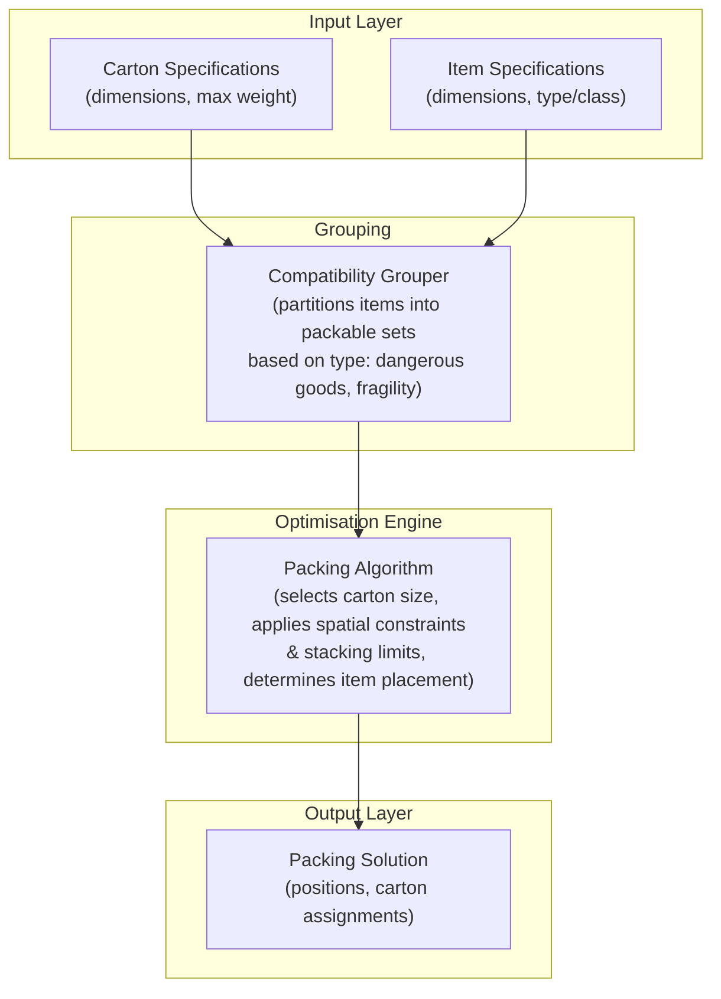

# Solver Team Overview

The solver team owns the core optimisation engine of Project Perfect Fit. At a high level, the engine takes two JSON inputs, carton specifications (dimensions, max weight) and item specifications (dimensions, type/class), and determines the optimal way to pack those items into cartons.

All items are assumed to be rectangular. A key constraint is item compatibility: certain items cannot be packed together (e.g. dangerous goods with general freight), so the engine must classify items and group them into valid packable sets before attempting to arrange them.

## Architecture



Proposed layers of the engine:

1. **Input:** Receives carton and item data as JSON.
2. **Classification & Grouping:** Tags items by type and partitions them into compatible groups.
3. **Constraint:** Applies compatibility rules (dangerous goods, fragility) and spatial constraints (weight limits, stacking).
4. **Optimisation:** Selects appropriate carton sizes and runs the 3D bin-packing algorithm to determine item placement.
5. **Output:** Returns a packing solution (item positions, carton assignments) and an optional utilisation report.

## Project layout

```
solver/
├── Cargo.toml
└── src/
    ├── main.rs        # CLI demo: builds sample boxes/items and runs the solver
    ├── lib.rs          # Crate root, re-exports models::* and solver::Solver
    ├── models.rs       # Working MVP data model (used by solver.rs today)
    ├── solver.rs       # Working MVP packing algorithm (Best-Fit Decreasing)
    ├── types.rs        # Canonical type vocabulary for the next iteration (see below)
    ├── constraints.rs  # needs to be updated: compatibility/constraint rules
    ├── packer.rs       # needs to be updated: packing/placement algorithm
    └── api/
        ├── mod.rs      # Declares handler + schema submodules
        ├── handler.rs  # needs to be updated: request handling
        └── schema.rs   # needs to be updatedJSON input/output schema (serde types)
```

### Current MVP (models.rs + solver.rs)

This is the working code exercised by main.rs today:

- **models.rs** defines Item, BoxType, AnchorPoint, PlacedItem, and PackedBox. Items carry an optional box_group used to isolate incompatible items from each other.
- **solver.rs** implements Solver, a Best-Fit Decreasing bin packer:
  - Active box types are sorted ascending by volume; items are sorted descending by volume, then weight.
  - Placement search uses an extreme-point (anchor point) method: each placed item exposes up to three new anchor points (its far corners along X, Y, Z), which are gravity-sorted (lowest Z, then Y, then X) and tried in order for the next item.
  - Each item is tried in all 6 axis-aligned rotations at each anchor point, with AABB overlap checks against items already in the box.
  - Enforces per-box-type weight limits (max_weight) and a supply cap (maximum_boxes).
  - Enforces box_group isolation: once a box has accepted an item from a given group, only items from that same group may join it (items with no group are unrestricted).
  - Returns Error if any item cannot be placed in any available box.

Run the demo:

```bash
cd solver
cargo run
```

Run the tests:

```bash
cd solver
cargo test
```

### Next iteration (types.rs)

types.rs was added as the canonical type vocabulary for the modules that don't exist yet, namely constraints.rs, packer.rs, and api/schema.rs, to build on. It is additive only; models.rs and solver.rs are untouched and still power the current MVP. Once the new modules land, types.rs is expected to replace models.rs.

It renames/reshapes the MVP types to match the architecture's vocabulary more closely:

| models.rs (current) | types.rs (next) | Notes |
| --- | --- | --- |
| Item.box_group | Item.compatibility_group | Same purpose, clearer name aligned with the "Compatibility Grouper" layer |
| BoxType | Container | box_weight → tare_weight, maximum_boxes → max_containers |
| PlacedItem | Placement | Adds .footprint() to get the placement's occupied Space |
| PackedBox | PackedContainer | assigned_box_group() → assigned_compatibility_group() |
| *(none)* | Space | New: an axis-aligned free rectangular region (fits, volume_cm3), for maximal-space-style packing search, not yet used by any packing algorithm |
| *(none)* | AnchorPoint | Not carried over: types.rs favours Space for free-region tracking instead of point-based anchors |

types.rs currently has its own unit tests (volume, fits, collision, footprint, weight/group aggregation) but is not yet wired into any solver. It exists purely as shared vocabulary until packer.rs, constraints.rs, and api/schema.rs are implemented against it.

### Stubs

- constraints.rs: empty. Intended to host the compatibility/constraint rules currently inlined in solver.rs::try_place_item (weight limits, group isolation, and future stacking/fragility rules), decoupled from the packing search itself.
- packer.rs: empty. Intended to host the next-generation packing/placement algorithm built on types.rs::Space, separate from the MVP anchor-point approach in solver.rs.
- api/handler.rs / api/schema.rs: empty. Intended to expose the solver over an API: schema.rs for request/response JSON shapes (likely built on types.rs), handler.rs for the request handling logic. Cargo.toml currently only depends on serde/serde_json; no web framework has been chosen yet.

## Known limitations / open questions

- Only serde + serde_json are declared as dependencies; there's no HTTP layer wired up yet, so the API stubs and the "JSON in/JSON out" input layer described above aren't reachable externally yet. The engine is only exercised via main.rs and unit tests.
- Group isolation in the current MVP solver only blocks items when both the box's assigned group and the item's group are Some and differ; ungrouped items are never restricted, and there's no dangerous-goods/fragility-specific logic yet, since grouping is a generic string tag.
- No stacking-order or fragility constraints are implemented yet (mentioned in the architecture doc's Constraint layer, but not in solver.rs or constraints.rs).
- types.rs::Space and AnchorPoint (in models.rs) represent two different placement-search strategies; when packer.rs is implemented, a decision is needed on which approach (or combination) to carry forward.
