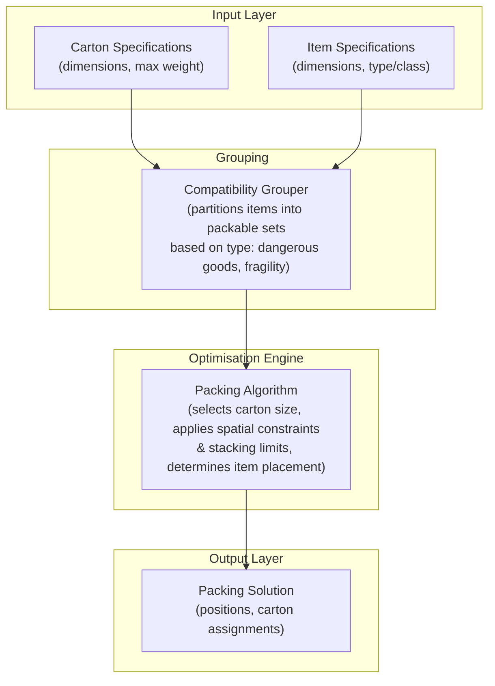

# Solver Team Overview

The solver team owns the core optimisation engine of Project Perfect Fit. At a high level, the engine takes two JSON inputs, carton specifications (dimensions, max weight) and item specifications (dimensions, type/class), and determines the optimal way to pack those items into cartons.

All items are assumed to be rectangular. A key constraint is item compatibility: certain items cannot be packed together (e.g. dangerous goods with general freight), so the engine must classify items and group them into valid packable sets before attempting to arrange them.

## Architecture



Proposed layers of the engine:

1. **Input:** Receives carton and item data as JSON.
2. **Classification & Grouping:** Tags items by type and partitions them into compatible groups.
3. **Constraint:** Applies compatibility rules (dangerous goods, fragility) and spatial constraints (weight limits, stacking).
4. **Optimisation:** Selects appropriate carton sizes and runs the 3D bin-packing algorithm to determine item placement.
5. **Output:** Returns a packing solution (item positions, carton assignments) and an optional utilisation report.

## Project layout

```
solver/
├── Cargo.toml
└── src/
    ├── main.rs         # The server. What "cargo run" starts.
    ├── lib.rs          # Crate root, re-exports models::* and solver::Solver
    ├── models.rs       # The data types in use today (Item, BoxType, PackedBox, ...)
    ├── solver.rs       # The packing algorithm in use today (Best-Fit Decreasing)
    ├── types.rs        # A second, unused set of types for the next iteration (see below)
    ├── constraints.rs  # Fit and weight checks, written against types.rs
    ├── packer.rs       # Empty. Intended for the next packing algorithm.
    ├── bin/            # Extra programs, each run with "cargo run --bin <name>"
    │   └── demo.rs           # Packs a hardcoded order and prints the layout
    └── api/
        ├── mod.rs      # Declares the delivery, handler, schema and router submodules
        ├── delivery.rs # Sends finished solutions on to the visualiser and portal
        ├── handler.rs  # The functions answering /solve and /health
        ├── router.rs   # Which URL maps to which handler, plus the CORS layer
        └── schema.rs   # The request and response shapes, as JSON
```

### Current MVP (models.rs + solver.rs)

This is the working code behind the /solve endpoint and the demo binary:

- models.rs defines Item, BoxType, AnchorPoint, PlacedItem, and PackedBox. Items carry an optional box_group used to isolate incompatible items from each other.
- solver.rs implements Solver, a Best-Fit Decreasing bin packer:
  - Active box types are sorted ascending by volume; items are sorted descending by volume, then weight.
  - Placement search uses an extreme-point (anchor point) method: each placed item exposes up to three new anchor points (its far corners along X, Y, Z), which are gravity-sorted (lowest Z, then Y, then X) and tried in order for the next item.
  - Each item is tried in all 6 axis-aligned rotations at each anchor point, with AABB overlap checks against items already in the box.
  - Enforces per-box-type weight limits (max_weight) and a supply cap (maximum_boxes).
  - Enforces box_group isolation: once a box has accepted an item from a given group, only items from that same group may join it (items with no group are unrestricted).
  - Returns Error if any item cannot be placed in any available box.

### Running the server

`cargo run` starts the HTTP server, and it keeps running until you stop it with Ctrl-C.

```bash
cd solver
cargo run
```

It prints the address it is listening on. By default that is `0.0.0.0:8080`, where `0.0.0.0`
means "accept connections on any network interface". That is deliberately wider than
`127.0.0.1`, which would only accept connections from your own machine: the warehouse worker
opens this from their phone, so other devices on the same network have to be able to reach
it.

To listen somewhere else, set the `LISTEN_ADDR` environment variable. This is useful when
port 8080 is already taken by something else:

```bash
LISTEN_ADDR=127.0.0.1:9099 cargo run
```

#### Sending solutions to the other teams

The Sprint 1 data flow in the [root README](../README.md) has the solver sending each finished
solution to the visualiser, with a copy to the portal, rather than only answering the caller
that asked for it. Both addresses come from the environment, so neither is compiled in:

```bash
VISUALIZER_URL=http://192.168.1.20:3000/solutions \
PORTAL_URL=http://192.168.1.21:4000/solutions \
cargo run
```

| Variable | Effect |
| --- | --- |
| `VISUALIZER_URL` | Where to POST the main copy of each solution. |
| `PORTAL_URL` | Where to POST the second copy. |

**Neither variable is set by default, and with neither set nothing is sent anywhere.** That is
the normal state while developing, and it makes the solver behave exactly as it did before
deliveries existed, so you do not need the portal or the visualiser running to work on it.
The server prints which destinations it picked up when it starts.

What gets sent is the same `PackingResponse` body the caller receives, byte for byte, so both
teams parse one shape. Points worth knowing before wiring this up to a real endpoint:

- **The solver does not wait for either delivery.** The caller gets their answer on their own
  connection and the copies go out behind it. A destination that is down is logged and that
  solution is lost: there is no queue and nothing is retried. Anything stronger needs
  somewhere to store solutions, which the solver deliberately does not have.
- **Send an `OrderId`** on the request if you want the solution tied back to the order it came
  from. It is echoed on the response and carried on both copies. A request without one still
  gets an identifier, made up by the solver and shaped `solve-<milliseconds>-<count>`, so a
  receiver always has something to key on.
- **Only `http` addresses work in this build.** TLS is left out because the library providing
  it needs cmake and a C compiler, which is a poor trade while everything is on one local
  network. An `https` address is warned about at startup; turning TLS on is a one line change,
  adding the `rustls` feature to `reqwest` in `Cargo.toml`.
- **CORS has nothing to do with this.** It is a rule browsers apply to pages they are running.
  A POST from this process to another server is not subject to it.

#### Endpoints

| Route | Method | What comes back |
| --- | --- | --- |
| `/health` | GET | 200 and the text `ok`. It does no work; a reply just means the server is running. The frontend uses it to check the solver is available. |
| `/solve` | POST | 200 and a `PackingResponse`: the `OrderId` this solution belongs to, and where every item was placed. A copy also goes to the visualiser and the portal when those are configured. |

`/solve` has two failure cases, which are separate on purpose so a caller can tell them
apart:

- **422** means the request body was not a valid `PackingRequest`, for example a missing or
  misspelled field. The problem is the request itself, and the body is a plain text message
  saying which field was wrong.
- **400** means the request was understood but the items could not be packed, for example an
  item too large for every available carton. The body is JSON, `{"Error": "..."}`.

`docs/example_data/combined.json` is a ready-made `PackingRequest` you can post as-is. It was
built by combining the `items.json` and `boxes.json` in that same directory:

```bash
curl http://localhost:8080/health
curl -X POST http://localhost:8080/solve \
  -H 'Content-Type: application/json' \
  --data @docs/example_data/combined.json
```

#### A note on CORS

Browsers block a page served from one address from reading a response from a different
address, unless the responding server sends headers saying it is allowed. Those headers are
CORS, and `api/router.rs` adds them with `CorsLayer::permissive()`, which allows every
origin.

That is a development convenience, so the frontend can call this API while it is still
moving between addresses. **Before this server is reachable from outside a local network,
replace it with the specific addresses the portal and visualiser are served from.**

### Running the demo

The demo packs a hardcoded set of cartons and items and prints the layout as text. It is the
quickest way to exercise the solver without starting the server:

```bash
cd solver
cargo run --bin demo
```

Run the tests:

```bash
cd solver
cargo test
```

### Next iteration (types.rs)

types.rs was added as the canonical type vocabulary for the modules that don't exist yet, namely constraints.rs, packer.rs, and api/schema.rs, to build on. It is additive only; models.rs and solver.rs are untouched and still power the current MVP. Once the new modules land, types.rs is expected to replace models.rs.

It renames/reshapes the MVP types to match the architecture's vocabulary more closely:

| models.rs (current) | types.rs (next) | Notes |
| --- | --- | --- |
| Item.box_group | Item.compatibility_group | Same purpose, clearer name aligned with the "Compatibility Grouper" layer |
| BoxType | Container | box_weight → tare_weight, maximum_boxes → max_containers |
| PlacedItem | Placement | Adds .footprint() to get the placement's occupied Space |
| PackedBox | PackedContainer | assigned_box_group() → assigned_compatibility_group() |
| *(none)* | Space | New: an axis-aligned free rectangular region (fits, volume_cm3), for maximal-space-style packing search, not yet used by any packing algorithm |
| *(none)* | AnchorPoint | Not carried over: types.rs favours Space for free-region tracking instead of point-based anchors |

types.rs currently has its own unit tests (volume, fits, collision, footprint, weight/group aggregation) but is not yet wired into any solver. It exists purely as shared vocabulary until packer.rs, constraints.rs, and api/schema.rs are implemented against it.

### Stubs

- packer.rs is an empty file. It is also missing from the module list in lib.rs, which means the compiler never even looks at it. It is intended to hold the next packing algorithm, built on types.rs::Space rather than the anchor-point approach in solver.rs.
- constraints.rs holds the fit and weight checks as standalone functions, written against types.rs. The catch is that solver.rs does not call them: it still has its own copies of the same rules written inline in try_place_item. The only thing the two genuinely share is the WEIGHT_TOLERANCE_KG constant, so a rule changed in one place has to be changed in the other by hand. Group isolation, and the stacking and fragility rules that do not exist yet, have not been moved across either.

## Known limitations / open questions

- A failed pack sends nothing out. One item no carton can hold makes /solve answer 400 and discard every carton it had already filled, so there is no partial solution to deliver either. Returning 200 with the boxes that did pack, plus a list of what did not, would fix both at once.
- Deliveries are best effort. A solution that could not be handed over is logged and gone, and there is no way to ask for it again afterwards, since the solver keeps no record of it.
- CORS currently allows every origin. That is fine while everything runs on one local network, and not fine anywhere else. See the note in the Running the server section above.
- Group isolation in the current MVP solver only blocks items when both the box's assigned group and the item's group are Some and differ; ungrouped items are never restricted, and there's no dangerous-goods/fragility-specific logic yet, since grouping is a generic string tag.
- No stacking-order or fragility constraints are implemented yet (mentioned in the architecture doc's Constraint layer, but not in solver.rs or constraints.rs).
- types.rs::Space and AnchorPoint (in models.rs) represent two different placement-search strategies; when packer.rs is implemented, a decision is needed on which approach (or combination) to carry forward.
