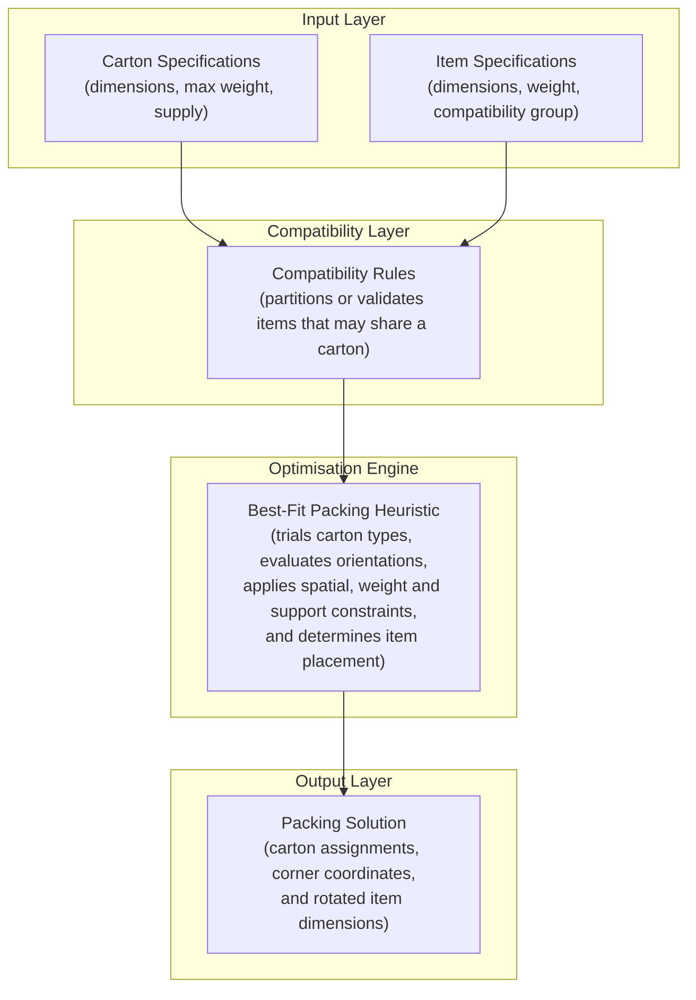

```mermaid
graph TD
    subgraph INPUT["Input Layer"]
        A["Carton Specifications\n(dimensions, max weight, supply)"]
        B["Item Specifications\n(dimensions, weight, compatibility group)"]
    end

    subgraph COMPATIBILITY["Compatibility Layer"]
        C["Compatibility Rules\n(partitions or validates items that may share a carton)"]
    end

    subgraph PACKING["Optimisation Engine"]
        D["Best-Fit Packing Heuristic\n(trials carton types, evaluates orientations,\napplies spatial, weight and support constraints,\nand determines item placement)"]
    end

    subgraph OUTPUT["Output Layer"]
        E["Packing Solution\n(carton assignments, corner coordinates,\nand rotated item dimensions)"]
    end

    A --> C
    B --> C
    C --> D
    D --> E
```
