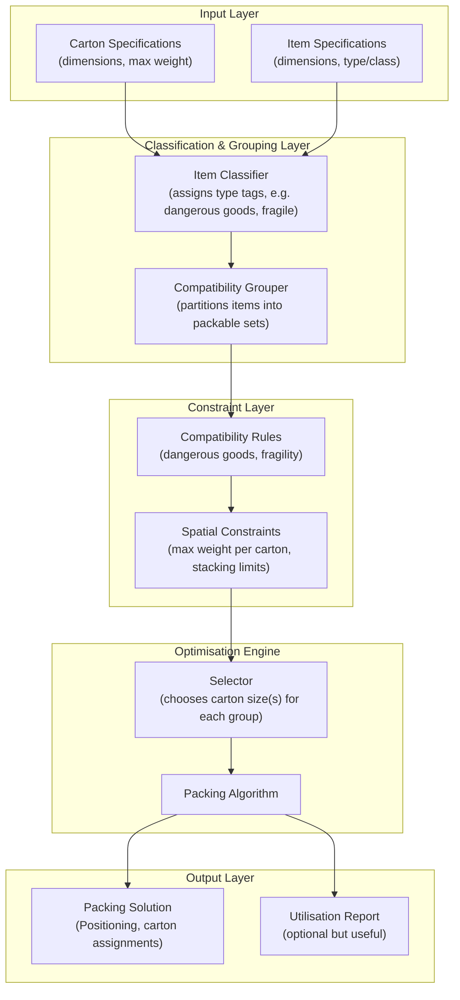

```mermaid
graph TD
    subgraph INPUT["Input Layer"]
        A["Carton Specifications\n(dimensions, max weight)"]
        B["Item Specifications\n(dimensions, type/class)"]
    end

    subgraph CLASSIFY["Classification & Grouping Layer"]
        C["Item Classifier\n(assigns type tags, e.g. dangerous goods, fragile)"]
        D["Compatibility Grouper\n(partitions items into packable sets)"]
    end

    subgraph CONSTRAINTS["Constraint Layer"]
        E["Compatibility Rules\n(dangerous goods, fragility)"]
        F["Spatial Constraints\n(max weight per carton, stacking limits)"]
    end

    subgraph SOLVER["Optimisation Engine"]
        G["Selector\n(chooses carton size(s) for each group)"]
        H["Packing Algorithm"]
    end

    subgraph OUTPUT["Output Layer"]
        I["Packing Solution\n(Positioning, carton assignments)"]
        J["Utilisation Report\n(optional but useful)"]
    end

    A --> C
    B --> C
    C --> D
    D --> E
    E --> F
    F --> G
    G --> H
    H --> I
    H --> J
```
