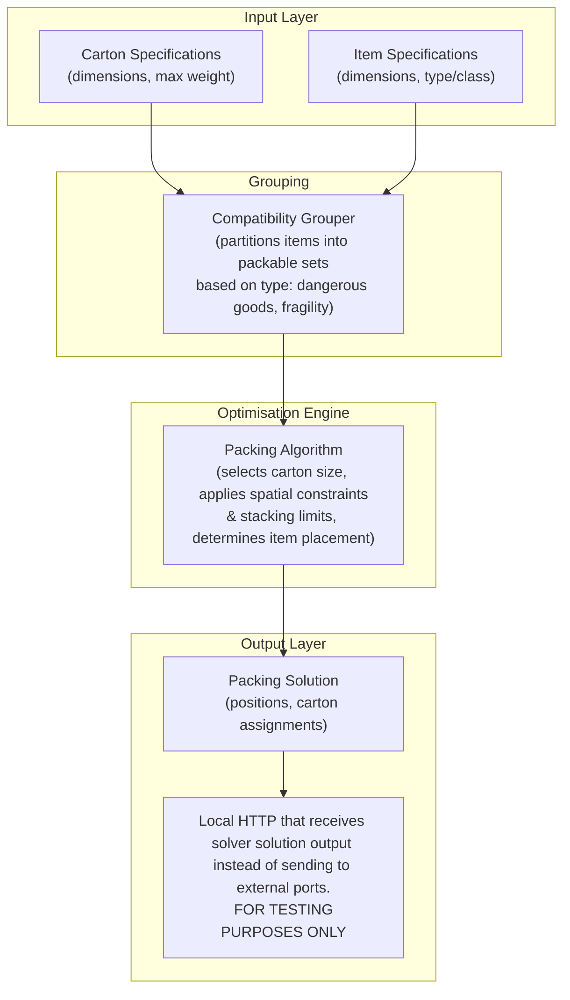

```mermaid
graph TD
    subgraph INPUT["Input Layer"]
        A["Carton Specifications\n(dimensions, max weight)"]
        B["Item Specifications\n(dimensions, type/class)"]
    end

    subgraph GROUPING["Grouping"]
        C["Compatibility Grouper\n(partitions items into packable sets\nbased on type: dangerous goods, fragility)"]
    end

    subgraph PACKING["Optimisation Engine"]
        D["Packing Algorithm\n(selects carton size, applies spatial constraints\n& stacking limits, determines item placement)"]
    end

    subgraph OUTPUT["Output Layer"]
        E["Packing Solution\n(positions, carton assignments)"]
    end
    
    subgraph OUTPUT["Test: Local Display"]
        F["Local HTTP that receives solver solution output instead of sending to external ports.\n FOR TESTING PURPOSES ONLY"]
    end

    A --> C
    B --> C
    C --> D
    D --> E
    E --> F
```