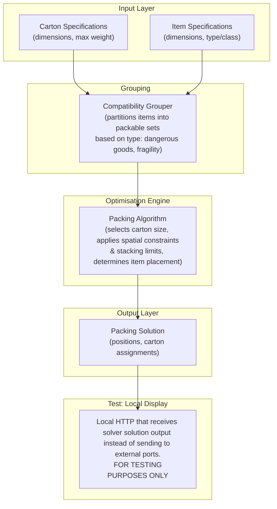

# Solver architecture: local test environment

This is solver_architecture.md with one extra stage on the end. It shows what a
local test environment looks like when the solver runs on its own, with no
Portal and no Visualizer: the packing solution is handed to a local HTTP
display instead of being sent anywhere else on the network.

It is a testing picture only. It is not a proposal for how the three modules
talk to each other in the real system, and it does not replace or compete with
the data flow diagrams in the repository root README, which are the authority on
that. Read solver_architecture.md for the solver's own stages without the test
stand-in attached.

